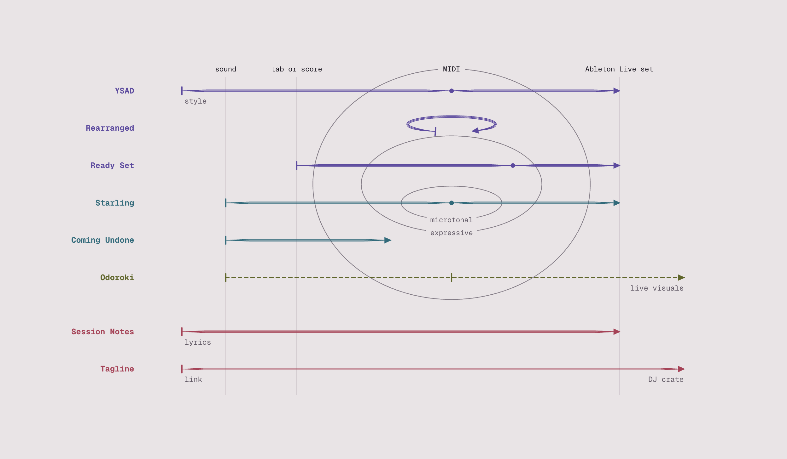

<a href="https://swwallowws.github.io/">
  <picture>
    <source media="(prefers-color-scheme: dark)" srcset="assets/map-night.png">
    
  </picture>
</a>

### producing music and tools, because I want to…

Every tool has its own page and a demo you can try in the browser: **[swwallowws.github.io](https://swwallowws.github.io/)**

• **You Suck At Drums**: drum patterns you can play live, in any time signature, around a circle. [Try it](https://swwallowws.github.io/ysad/)\
• **Rearranged**: rearrange a song in the style of another. [Studio](https://swwallowws.github.io/rearranged-web/)\
• **Ready Set**: open a tab or a score as a playable Ableton Live set. [Website](https://swwallowws.github.io/ready-set/) · [Code](https://github.com/swwallowws/ready-set)\
• **Starling**: sing a phrase, get MIDI that keeps every glide, in any tuning. [Studio](https://swwallowws.github.io/starling/) · [Code](https://github.com/swwallowws/starling)\
• **Coming Undone**: split a recording into its parts and write each one down as MIDI. [Studio](https://swwallowws.github.io/coming-undone/) · [Code](https://github.com/swwallowws/coming-undone)\
• **Session Notes**: notes that live with the set, lyrics that land on the arrangement. [Download](https://github.com/swwallowws/ableton-session-notes/releases/latest) · [Code](https://github.com/swwallowws/ableton-session-notes)\
• **Tagline**: a plain-text music crate whose tags travel inside the audio files. [How it works](https://swwallowws.github.io/intentional/)

Next up: **Odoroki**, live visuals that follow the music you play and react when it surprises you.
